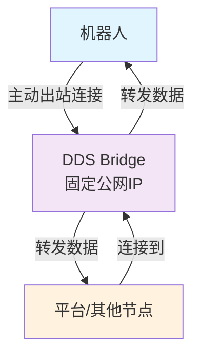
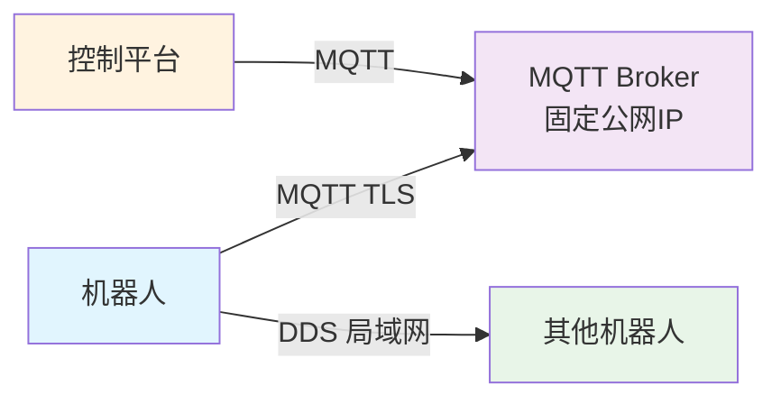

# 机器人平台网络互通与视频流技术方案

## 1. 项目概述

本项目旨在构建一个机器人控制平台，核心功能包括：
1.  **指令下发**：平台可向远程机器人发送控制指令。
2.  **视频监控**：平台可接收来自机器人的实时视频流或图片，用于监控和远程操控。

**核心挑战**：
- 机器人通过 4G 移动网络接入互联网，无固定公网 IP 地址，导致平台无法直接访问。
- 在复杂的 4G 网络环境下，保证指令的可靠送达与视频流的低延迟、高质量传输。

## 2. 整体架构设计

系统采用基于 **MQTT** 的信令与控制通道和基于 **WebRTC** 的媒体传输通道相分离的架构，实现解耦与高性能。

### 2.1 架构图


### 2.2 组件说明

-   **MQTT Broker**：通信中枢。负责所有信令和控制消息的路由。推荐使用 **EMQX**（开源高性能）。
-   **平台后端**：处理业务逻辑，作为 MQTT 客户端，向指定主题发布指令并订阅状态主题。
-   **用户前端**：Web 应用或 App，用于显示UI、发送指令、并通过 WebRTC 接收和渲染视频流。
-   **机器人端代理**：在机器人上运行的程序。作为 MQTT 客户端，订阅指令主题，发布状态主题，并管理 WebRTC 连接。
-   **WebRTC TURN 服务器**：用于在机器人与客户端 P2P 直连失败时，中转媒体流量。推荐使用 **Coturn**。
-   **信令通道**：使用 **MQTT 协议** 传输 WebRTC 的 SDP Offer/Answer 和 ICE Candidate，实现信令交换。

## 3. 技术方案详述

### 3.1 网络互通与指令下发（基于 MQTT）

采用 **发布/订阅 (Pub/Sub)** 模型解决机器人无固定 IP 的问题。

#### 3.1.1 主题设计

-   **指令主题 (Platform → Robot)**: `robot/{device_id}/cmd`
-   **状态/数据主题 (Robot → Platform)**: `robot/{device_id}/status`
-   **广播主题 (Platform → All Robots)**: `robot/all/cmd`
-   **WebRTC 信令主题**: `robot/{device_id}/webrtc/{signal_type}`

#### 3.1.2 工作流程

1.  **连接建立**：机器人启动后，主动与预设的 MQTT Broker 建立持久化连接，并订阅其专属指令主题 `robot/001/cmd`。
2.  **指令下发**：平台后端向 `robot/001/cmd` 主题发布指令消息。
    ```json
    {
      "command_id": "cmd_123456", // 唯一指令ID，用于匹配响应
      "action": "move",
      "direction": "forward",
      "param": "1.0"
    }
    ```
3.  **指令推送**：MQTT Broker 将指令推送给已订阅的机器人。
4.  **状态回报**：机器人执行完毕后，向状态主题 `robot/001/status` 发布消息。
    ```json
    {
      "command_id": "cmd_123456", // 匹配原指令ID
      "status": "success",
      "message": "Moved 1.0m forward"
    }
    ```
5.  **状态接收**：平台后端订阅了 `robot/001/status`，接收并处理该状态消息。

#### 3.1.3 QoS 保证
-   对关键指令和状态消息使用 **QoS 1**（至少送达一次），确保可靠性。
-   对非关键传感器数据使用 **QoS 0**（至多一次），提高效率。

### 3.2 视频流传输（基于 WebRTC）

根据对延迟和带宽的不同要求，提供两种方案。

#### 3.2.1 方案A：实时视频流（低延迟）

适用于远程实时操控场景。

-   **技术**：使用 WebRTC 的 `RTCPeerConnection` 和 `videoTrack`。
-   **机器人端**：
    -   使用 **GStreamer** 采集摄像头、编码（H.264）、并通过 `webrtcbin` 元素推送。
    -   **示例管道**：
        ```bash
        gst-launch-1.0 v4l2src ! videoconvert ! x264enc tune=zerolatency bitrate=1024 ! video/x-h264,profile=baseline ! h264parse ! rtph264pay config-interval=-1 ! application/x-rtp,media=video,encoding-name=H264,payload=96 ! webrtcbin name=webrtcbin
        ```
-   **平台端**：
    -   浏览器使用 `RTCPeerConnection` API 接收流，并通过 `<video>` 标签播放。
    -   **关键代码**：
        ```javascript
        peerConnection.ontrack = (event) => {
            document.getElementById('videoElement').srcObject = event.streams[0];
        };
        ```
-   **优点**：延迟极低（100-500ms），体验流畅。
-   **缺点**：带宽占用较高。

#### 3.2.2 方案B：图片推送（低带宽）

适用于带宽受限或只需周期性画面的巡检场景。

-   **技术**：使用 WebRTC 的 `DataChannel`。
-   **机器人端**：
    -   定期捕获视频帧（如用 OpenCV），压缩为 JPEG/PNG。
    -   通过 `DataChannel` 的 `send()` 方法发送图片二进制数据。
-   **平台端**：
    -   在 `DataChannel` 的 `onmessage` 事件中接收数据，并转换为图片显示。
    -   **关键代码**：
        ```javascript
        dataChannel.onmessage = (event) => {
            const blob = new Blob([event.data], {type: 'image/jpeg'});
            const url = URL.createObjectURL(blob);
            document.getElementById('imageElement').src = url;
        };
        ```
-   **优点**：带宽占用极低。
-   **缺点**：延迟较高（500ms+），非实时流。

### 3.3 信令交换

WebRTC 需要交换 SDP 和 ICE 信息以建立连接。我们复用可靠的 MQTT 通道进行信令传输。

1.  **Offer (机器人 → 平台)**:
    -   机器人创建 Offer SDP。
    -   发布到 `robot/001/webrtc/offer`。
2.  **Answer (平台 → 机器人)**:
    -   平台收到 Offer，创建 Answer SDP。
    -   发布到 `robot/001/webrtc/answer`。
3.  **ICE Candidate (双向)**:
    -   双方不断产生 ICE Candidate，并分别发布到 `robot/001/webrtc/ice_candidate`。

### 3.4 网络适应性优化

-   **STUN/TURN 服务**：必须部署 **Coturn** 等 TURN 服务器，作为 P2P 连接失败的的中继备份，极大提高连接成功率。
-   **自适应码率**：WebRTC 内置拥塞控制算法，能根据网络状况动态调整视频码率和分辨率，保证流畅性。
-   **前向纠错 (FEC)**：WebRTC 支持 FEC，在一定丢包率下无需重传即可修复数据，减少卡顿。

## 4. 推荐技术选型

| 组件               | 推荐技术                                                     | 备注                                                                 |
| ------------------ | ------------------------------------------------------------ | -------------------------------------------------------------------- |
| **MQTT Broker**    | **EMQX** (开源版)                                            | 高性能，支持集群，自带规则引擎，可与数据库集成                         |
| **WebRTC (机器人)** | **GStreamer** (Linux/嵌入式) 或 **Pion** (Go)                 | GStreamer 生态成熟，Pion 更适合 Go 技术栈                            |
| **WebRTC (平台)**  | **浏览器原生 API** (Web) 或 **libwebrtc** (Native App)        | 无需额外库，兼容性好                                                   |
| **TURN 服务器**     | **Coturn**                                                   | 开源标准方案                                                           |
| **编程语言**       | 平台后端：Go/Java/Python；机器人端：C++/Go/Python (依机器人系统而定) |                                                                      |

## 5. 部署与实施建议

1.  **第一阶段：原型验证**
    -   部署单节点 EMQX。
    -   实现基于 MQTT 的指令下发与状态回报。
    -   使用 GStreamer 和浏览器 WebRTC API 建立最简单的视频推拉流 Demo。
    -   部署 Coturn 服务器。
2.  **第二阶段：功能完善**
    -   完善信令流程（MQTT 交换 SDP/ICE）。
    -   在机器人端实现码率、分辨率等参数可配置。
    -   在前端实现多机器人切换、全屏等 UI 功能。
3.  **第三阶段：生产环境部署**
    -   EMQX 部署为集群模式，保证高可用。
    -   Coturn 配置冗余和负载均衡。
    -   实施全面的安全措施（TLS、认证、授权）。
    -   建立监控系统，监控 Broker 连接数、消息吞吐、TURN 流量等关键指标。

## 6. 安全考虑

-   **传输加密**：所有 MQTT 连接必须使用 **TLS/SSL** 加密。WebRTC 媒体流自动加密（SRTP）。
-   **身份认证**：
    -   MQTT：为每个机器人分配唯一的客户端 ID、用户名、密码或客户端证书。
    -   TURN：配置长期凭证或 TURN REST API 进行动态鉴权。
-   **授权**：在 MQTT Broker 上配置 ACL，严格控制每个机器人客户端对主题的发布和订阅权限。
-   

## 5. 在机器人通过 **4G 移动网络（无固定公网 IP）** 的场景下使用 DDS 存在的主要问题：

### **1. 网络地址问题（最严重）**

- **问题**：DDS 的自动发现机制依赖 **多播（Multicast）** 和 **双向直接通信**
- **后果**：其他节点无法主动发现和连接到 4G 网络中的机器人

### **2. NAT 穿透问题**
- 4G 运营商通常使用 **CGNAT**（运营商级 NAT）
- DDS 的端口映射和发现机制会被 NAT 阻断

### **3. 发现机制失效**
```bash
# DDS 发现使用的多播地址（被 NAT 阻断）
239.255.0.1  # 默认发现多播地址
```

### **4. 网络稳定性**
- 4G 网络存在延迟波动、带宽限制、偶尔断线等问题
- DDS 的 QoS 机制可能无法完全适应这种网络环境

---

## **✅ 解决方案**

### **方案 1：DDS over Bridge（推荐）**
**使用 DDS 桥接器解决 NAT 问题：**


#### **实现方式：**
```bash
# 使用 CycloneDDS 的转发器功能
cdds forward --relay --port 7400 --peers 192.168.1.100

# 或使用专业的 DDS 桥接软件
# RTI Routing Service, OpenSplice Tuner
```

### **方案 2：静态配置发现信息**
**手动配置 DDS 发现信息，绕过自动发现：**
```xml
<!-- robots.xml -->
<CycloneDDS>
    <Domain id="0">
        <Peers>
            <Peer address="104.18.21.123"/> <!-- 公网桥接器 -->
            <Peer address="192.168.1.100"/> <!-- 本地节点 -->
        </Peers>
    </Domain>
</CycloneDDS>
```

### **方案 3：混合架构（DDS + MQTT）**
**利用各自优势：**


#### **实现代码示例：**
```python
# 机器人端：MQTT 到 DDS 的桥接
import paho.mqtt.client as mqtt
import cyclonedds

def on_mqtt_message(client, userdata, msg):
    # 将 MQTT 消息转换为 DDS 数据
    dds_writer.write(mqtt_to_dds(msg.payload))

# DDS 到 MQTT 的转换
def on_dds_data(data):
    mqtt_client.publish("robot/status", dds_to_mqtt(data))
```

---

## **⚙️ 配置建议**

### **1. DDS 配置优化**
```bash
# 禁用多播发现
export CYCLONEDDS_URI='<Discovery><Peers><Peer address="104.18.21.123"/></Peers></Discovery>'

# 使用 TCP 传输而非 UDP
export CYCLONEDDS_URI='<General><Transport>tcp</Transport></General>'
```

### **2. QoS 策略调整**
```cpp
// 适应不稳定的网络环境
DataWriterQos qos;
qos.reliability.kind = BEST_EFFORT_RELIABILITY_QOS;  // 改为尽力而为
qos.history.depth = 5;  // 限制历史深度
qos.durability.kind = VOLATILE_DURABILITY_QOS;  // 不持久化
```

### **3. 心跳和超时设置**
```cpp
// 调整发现参数，适应高延迟网络
ResourceLimitsQosPolicy limits;
limits.max_samples = 50;
limits.initial_peers = 3;

// 增加超时时间
Duration_t timeout = {10, 0};  // 10秒超时
```

---

## **📊 方案对比**

| 方案 | 优点 | 缺点 | 适用场景 |
|------|------|------|---------|
| **DDS Bridge** | 保持 DDS 所有特性 | 需要额外服务器 | 对实时性要求高的场景 |
| **静态配置** | 无需额外组件 | 配置复杂，不灵活 | 节点数量少的固定部署 |
| **DDS+MQTT** | 利用各自优势 | 系统复杂度增加 | 混合网络环境 |

---

## **💡 实践建议**

1. **先测试网络条件**：
   ```bash
   # 测试网络延迟和稳定性
   ping your-broker-address
   # 测试端口可达性
   telnet your-broker-address 7400
   ```

2. **逐步实施**：
   - 首先在局域网测试 DDS 功能
   - 然后添加桥接器测试广域网连接
   - 最后优化 QoS 参数适应移动网络

3. **监控和日志**：
   ```bash
   # 启用 CycloneDDS 调试日志
   export CYCLONEDDS_URI='<Tracing><Verbosity>finest</Verbosity></Tracing>'
   ```

**总结**：在 4G 移动网络下使用 DDS 是可行的，但需要额外的桥接或代理机制来解决 NAT 和动态 IP 问题。推荐使用 **DDS Bridge** 方案来保持 DDS 的性能优势。